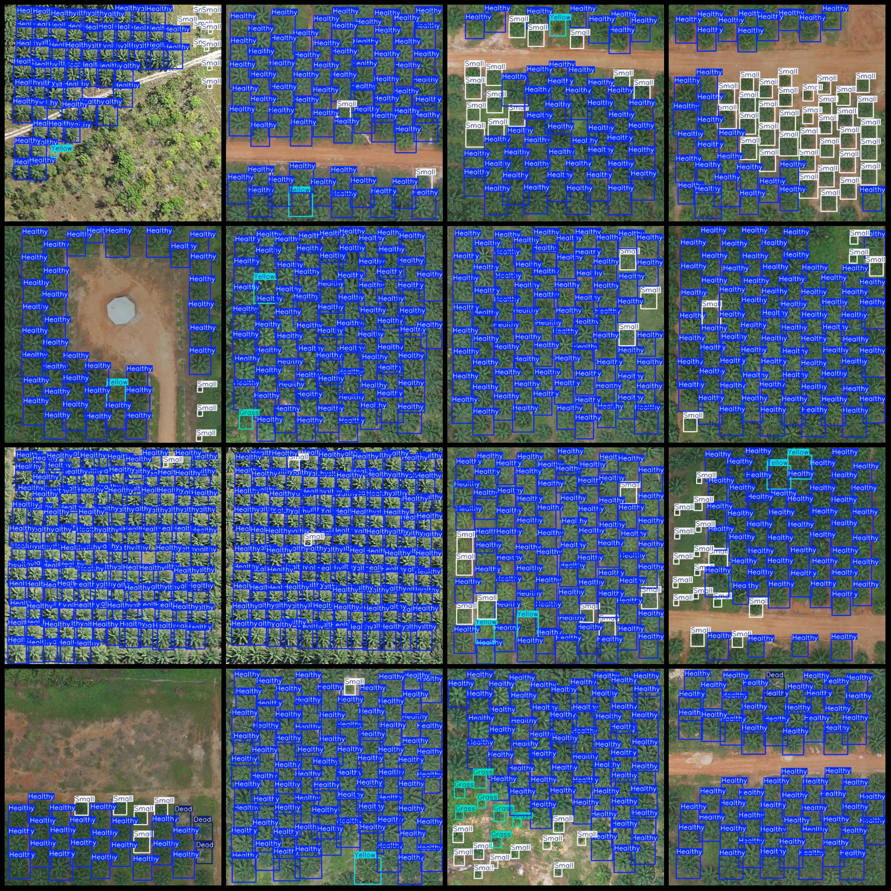
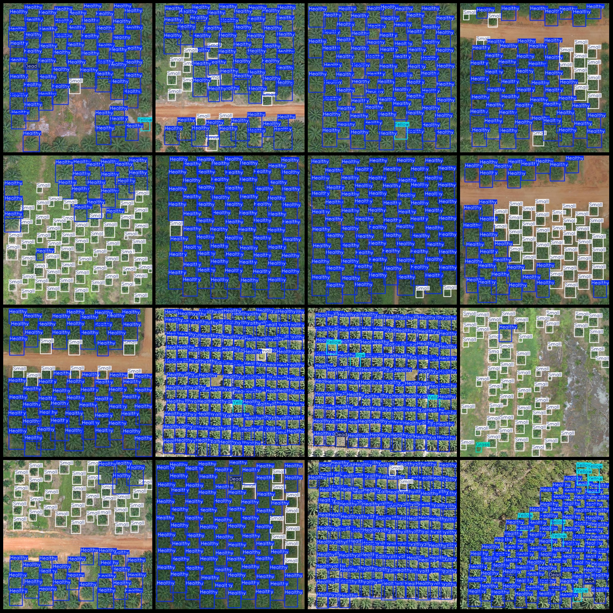

# Drone Perspective Aerial Photo Health Status Detection Dataset VOC+YOLO Format: 3131 Images in 5 Categories

Dataset format: Pascal VOC format + YOLO format (txt file without split path, only contains jpg images and corresponding VOC format xml files and yolo format txt files)
Number of images (jpg file count): 3131
Number of annotations (xml file count): 3131
Number of annotations (txt file count): 3131
Number of categories: 5
Annotation category names (note that the order of categories in the yolo format is not consistent with this, but refer to the labels folder's classes.txt for reference): ["Dead", "Grass", "Healthy", 
"Small", "Yellow"]
Box counts per category:
- Dead (dead trees) = 561
- Grass (grass) = 845
- Healthy (healthy) = 187061
- Small (small) = 45224
- Yellow (yellow) = 4889
Total boxes = 238580
Number of images per category:
- Dead = 331
- Grass = 303
- Healthy = 3007
- Small = 2659
- Yellow = 1622
Image resolution: 640x640
Annotation tool used: labelImg
Annotation rules: Draw a box around the category
Important notice: The dataset does not have separate training validation test sets; you must divide them yourself.
Special notice: This dataset does not guarantee the accuracy of trained models or weight files.
Image preview:

## Image

Here is a pay link on Stripe ( https://buy.stripe.com/3cs8yP7sY87d0vu9AB ). Please contact me lonlonago@foxmail.com after funding $89, and I will send you a complete data files , thank you!

